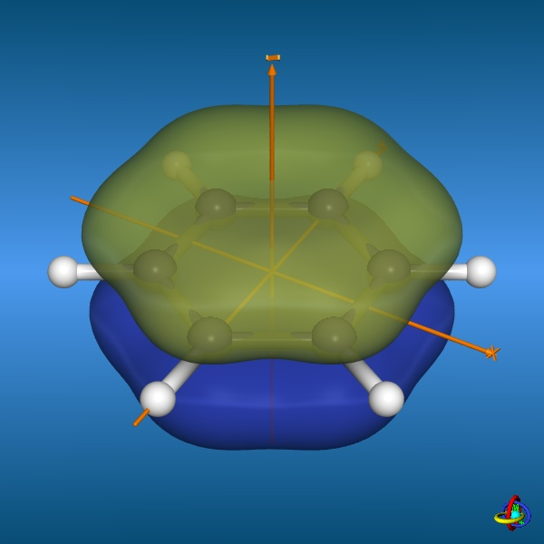
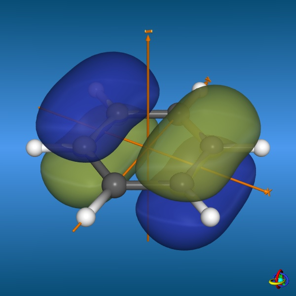
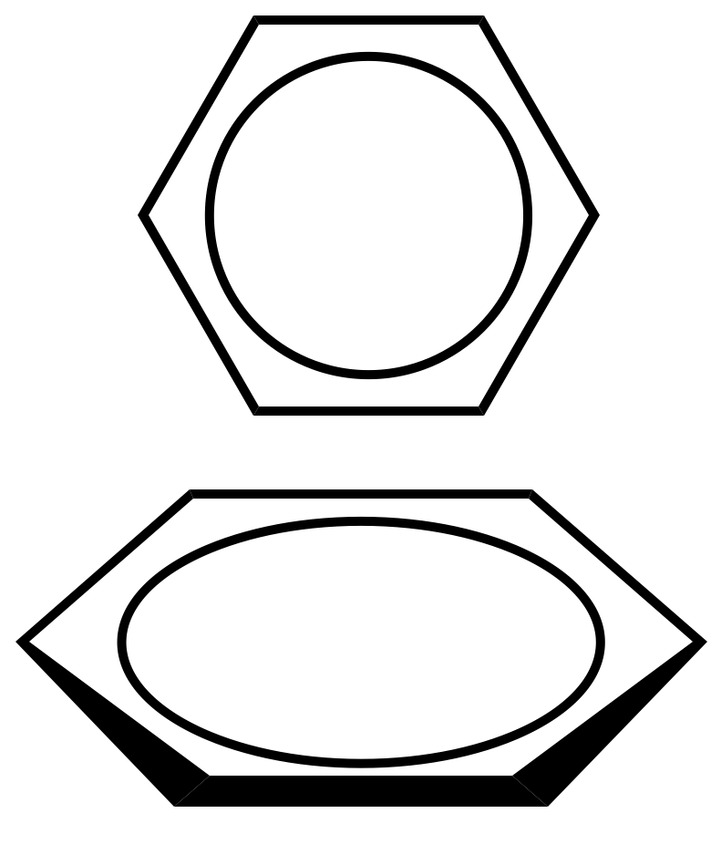
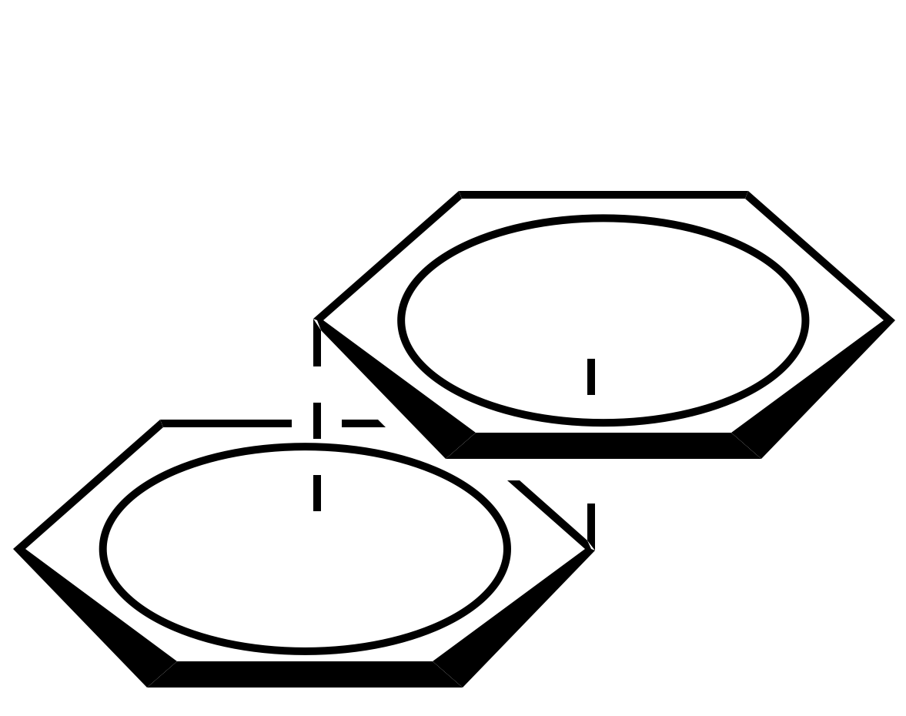
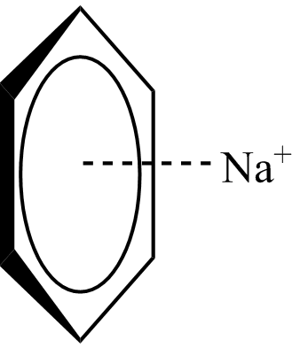

# π-interactions

π-interactions are types of non-covalent interactions that involve the attractive forces between ions or molecules and the electron-rich π-systems of aromatic rings.

TODO:

=== "Benzene lowest-occupied molecular orbital"

    <figure markdown>
    { alight=left width=300 }
    </figure>

    **Credit:** [Dr. S. Immel](http://csi.chemie.tu-darmstadt.de/ak/immel/tutorials/orbitals/molecular/benzene.html#orbitals)

=== "Benzene highest-occupied molecular orbitals"

    <figure markdown>
    { alight=left width=300 }
    </figure>

    <figure markdown>
    { alight=left width=300 }
    </figure>

    **Credit:** [Dr. S. Immel](http://csi.chemie.tu-darmstadt.de/ak/immel/tutorials/orbitals/molecular/benzene.html#orbitals)

## π-π

=== "Face-to-face"

    <figure markdown>
    { alight=left width=200 }
    </figure>

=== "Edge-to-face"

    <figure markdown>
    { alight=left width=200 }
    </figure>

=== "Displaced"

    <figure markdown>
    { alight=left width=200 }
    </figure>

## Cation-π

<figure markdown>
{ alight=left width=200 }
</figure>
