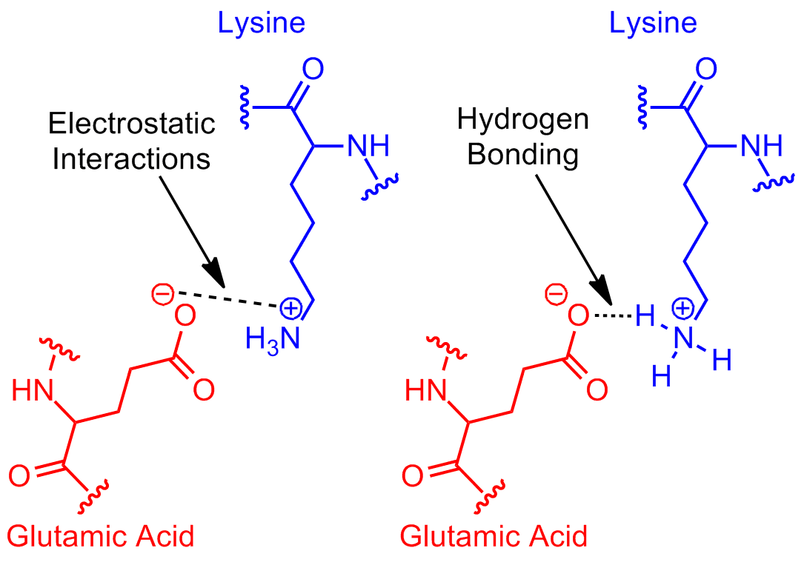

# Salt bridges

A salt bridge is a type of non-covalent interaction that occurs between two oppositely charged functional groups, typically between the negatively charged carboxylate group (COO⁻) of an acidic amino acid (such as aspartic acid or glutamic acid) and the positively charged amino group (NH3⁺) of a basic amino acid (such as lysine or arginine).

!!! quote "**Figure 1**"

    <figure markdown>
    { alight=left width=500 }
    </figure>

    Example of salt bridge between amino acids glutamic acid and lysine demonstrating electrostatic interaction and hydrogen bonding.

A salt bridge is a combination of intermolecular interactions:

1.  **Hydrogen bonding:** The hydrogen atom attached to the positively charged amino group (NH3⁺) can form a hydrogen bond with one of the oxygen atoms of the negatively charged carboxylate group (COO⁻).
    Hydrogen bonds are relatively strong non-covalent interactions that occur when a hydrogen atom bonded to an electronegative atom (such as nitrogen or oxygen) is attracted to another electronegative atom.
2.  **Electrostatic interactions:** The opposite charges of the carboxylate group (COO⁻) and the amino group (NH3⁺) attract each other through electrostatic interactions, also known as ionic bonds.
    These interactions are based on the attraction between oppositely charged ions and contribute to the stability of the salt bridge.

The combination of hydrogen bonding and electrostatic interactions in a salt bridge provides stability to the local structure of a protein or other biomolecule.
Salt bridges can be important for:

1.  Maintaining the tertiary structure of proteins by stabilizing the folded conformation.
2.  Facilitating protein-protein interactions by providing a favorable interface between two proteins.
3.  Contributing to the stability of protein complexes, such as enzyme-substrate complexes or receptor-ligand complexes.
4.  Participating in catalytic mechanisms of enzymes by stabilizing transition states or reaction intermediates.

It's important to note that the strength and stability of salt bridges can be influenced by factors such as the pH and ionic strength of the surrounding environment.
Changes in these conditions can affect the protonation state of the acidic and basic amino acids involved in the salt bridge, potentially disrupting the interaction.
